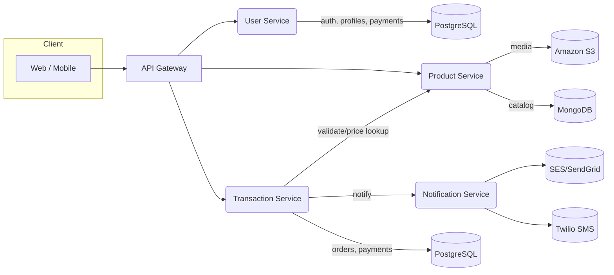
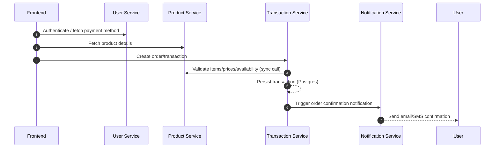

## TL;DR

An e‑commerce backend built from four small, focused services. Each service does one job well, can be deployed on its own, and plays nicely with the others. Products live in MongoDB, users and orders live in Postgres, images go to S3, and messages go out via Email/SMS. It’s serverless, TypeScript, and ready for real-world workflows.

## Why This Project

To show a practical, cloud‑native way to build an online store without one giant backend. Instead, you get clear building blocks:

- Own your data per domain (catalog vs. customers vs. orders)
- Ship and scale services independently
- Keep deployments repeatable with infrastructure-as-code
- Plug in email/SMS without adding complexity to business logic

## Architecture Overview

At a glance: a few small services behind an API, each with the storage and tools it needs. They talk directly when it’s simple, and trigger notifications when something worth telling the user happens.



### Service Responsibilities

- Product Service: product/catalog APIs, categories, S3 presigned uploads (MongoDB persistence)
- User Service: authentication, profiles, addresses, payment methods (PostgreSQL)
- Transaction Service: order/transaction recording and orchestration (PostgreSQL)
- Notification Service: email and SMS delivery via SES/SendGrid and Twilio

### Typical Checkout Sequence (Human-friendly)



## Tech Stack & Tooling

- Language & Runtime: TypeScript on Node.js
- Infrastructure as Code:
  - AWS CDK (TypeScript) for `product-service`, `transaction-service`, `notification-service`
  - Serverless Framework for `user-service` (with `serverless-offline` for local dev)
- Data:
  - MongoDB via `mongoose` (products, categories)
  - PostgreSQL via `pg` and `db-migrate-pg` (users, transactions)
- Storage & Media: Amazon S3 + `@aws-sdk/s3-request-presigner` for upload flows
- Messaging: SES and/or SendGrid for email; Twilio for SMS
- Validation: `class-validator` + `class-transformer` for input DTOs
- Testing: Jest across services

## Services Overview

### Product Service (Catalog & Images)

- Purpose: Product/catalog APIs (products, categories), image handling via S3 presigned URLs
- Notable directories:
  - `src/handlers/`: HTTP/Lambda handlers (`products-api.ts`, `category-api.ts`, `image-api.ts`, `message-queue.ts`)
  - `src/model/`: Mongoose schemas (`products-model.ts`, `category-model.ts`)
  - `src/service/`: business logic (`products-service.ts`, `category-service.ts`)
  - `lib/`: CDK stacks (API Gateway, Lambdas, S3 bucket)
- Key dependencies: `mongoose`, `@aws-sdk/client-s3`, `@aws-sdk/s3-request-presigner`, `aws-cdk-lib`
- Local development:

```bash
cd product-service
npm install
npm run build
# Local API emulation (from package.json):
npm run dev  # cdk synth + sam local start-api
```

### User Service (Auth & Profiles)

- Purpose: Authentication, user profiles/addresses, payment-method integration (Stripe)
- Notable directories:
  - `app/`: handlers (`handler.ts`, plus feature folders)
  - `migrations/`: DB migrations (users, addresses, carts, payment methods)
  - `serverless.yml`: Serverless Framework configuration (functions + resources)
- Key dependencies: `pg`, `db-migrate-pg`, `bcryptjs`, `jsonwebtoken`, `stripe`, `serverless-offline`
- Local development:

```bash
cd user-service
npm install
npm run dev  # tsc && sls offline start --verbose
```

### Transaction Service (Orders)

- Purpose: Orders/transactions recording and related orchestration
- Notable directories:
  - `migrations/`: schema evolution for Postgres (with raw SQL files)
  - `src/`: DTOs and handlers for transaction workflows
  - `lib/`: CDK stacks (API Gateway, Lambdas, DB connectivity)
- Key dependencies: `pg`, `db-migrate-pg`, `class-validator`, `aws-cdk-lib`
- Local development:

```bash
cd transaction-service
npm install
npm run build
```

### Notification Service (Email & SMS)

- Purpose: Centralized outbound messaging: email (SES/SendGrid) and SMS (Twilio)
- Notable directories:
  - `src/providers/`: provider abstractions (`email.ts`, `sms.ts`)
  - `src/handlers/`: `emailHandler.ts`, `smsHandler.ts`, `index.ts`
  - `lib/`: CDK stacks wiring handlers and permissions
- Key dependencies: `@aws-sdk/client-ses`, `@sendgrid/mail`, `twilio`, `aws-cdk-lib`
- Local development:

```bash
cd notification-service
npm install
npm run build
```

## How Services Work Together

- Checkout flow: frontend authenticates with User Service, reads product data from Product Service, creates a transaction via Transaction Service, which validates with Product Service and triggers Notification Service to confirm the order.
- Media flow: Product Service issues presigned S3 URLs; clients upload directly to S3; metadata/URLs stored in MongoDB.
- Messaging: Services invoke Notification Service to send transactional emails/SMS.

## Configuration & Secrets (Keep it Safe)

- `.env` via `dotenv` used across services for local configuration.
- Use AWS Secrets Manager or SSM Parameter Store for production secrets: DB creds, Stripe keys, SendGrid/Twilio tokens.
- Principle of least privilege for IAM roles per Lambda.

## Testing & Quality

- Jest configured per service (`npm test`).
- DTO validation via `class-validator` improves input correctness and error reporting.
- Recommend: contract tests for cross-service APIs; load tests for hot paths (listing products, checkout).

## Deployment (Copy & Paste)

- CDK services (`product`, `transaction`, `notification`):

```bash
# Synthesize CloudFormation
npx cdk synth

# Deploy selected stack (ensure AWS credentials are configured)
npx cdk deploy
```

- Serverless service (`user-service`):

```bash
cd user-service
npm install
npm run deploy  # sls deploy --verbose
```

## Observability & Ops

- CloudWatch Logs per function; consider structured JSON logs (requestId, userId, path, latency).
- Metrics & alerts: error rates, cold starts, P99 latency by route.
- Tracing: add X-Ray or OpenTelemetry for cross-service traces in checkout flow.

## Security Considerations

- Authentication & Authorization: JWTs (user-service). Validate JWTs on API routes that require identity.
- Data: parameterized queries (`pg`), hashed passwords (`bcryptjs`), encrypted secrets.
- Storage: presigned URL expirations; S3 bucket policies with least privilege.
- Ingress: rate limiting at API Gateway; WAF for public endpoints.

## Trade‑offs & Lessons

- Polyglot persistence: MongoDB for flexible catalog; Postgres for transactional integrity.
- CDK + Serverless mix: keeps each service on its best-fit tooling; CI needs to orchestrate both.
- Centralized notifications simplify compliance and provider rotation (SES/SendGrid/Twilio) behind a single service boundary.
- Presigned uploads remove Lambdas from the data plane for media, reducing cost and latency.

## Future Improvements

- Introduce an event bus (Amazon EventBridge) for decoupled domain events (OrderCreated → Notifications, Inventory updates) and retries/DLQs.
- Idempotency keys on transaction endpoints to guard against duplicate orders.
- API contracts (OpenAPI) and typed clients to harden cross-service boundaries.
- Automated DB migrations in CI/CD with safe rollout and rollback steps.
- Add health/readiness endpoints, and synthetic canaries for smoke checks.

## Quickstart (Local)

```bash
# Product Service
cd product-service && npm install && npm run build && npm run dev

# User Service (Serverless offline)
cd user-service && npm install && npm run dev

# Transaction Service
cd transaction-service && npm install && npm run build

# Notification Service
cd notification-service && npm install && npm run build
```

---

## Copy‑Paste Asset Pack

- OpenAPI stubs (import into Postman/Swagger):

  - Product: ./product-service/openapi.yaml
  - User: ./user-service/openapi.yaml
  - Transaction: ./transaction-service/openapi.yaml
  - Notification: ./notification-service/openapi.yaml

- CI pipelines (GitHub Actions):
  - Product: .github/workflows/product-service.yml
  - User: .github/workflows/user-service.yml
  - Transaction: .github/workflows/transaction-service.yml
  - Notification: .github/workflows/notification-service.yml

Tip: Replace AWS credentials in repo secrets (`AWS_ACCESS_KEY_ID`, `AWS_SECRET_ACCESS_KEY`, `AWS_REGION`). For Serverless, ensure `npx serverless` can run in CI (already handled in the workflow).

---
